⚠**Proyecto en desarrollo**⚠

<h2>Pagina web realizada para un restaurante, donde tenemos la opción de delivery</h2>

<h2 align="center"> Vista del Inicio </h2>

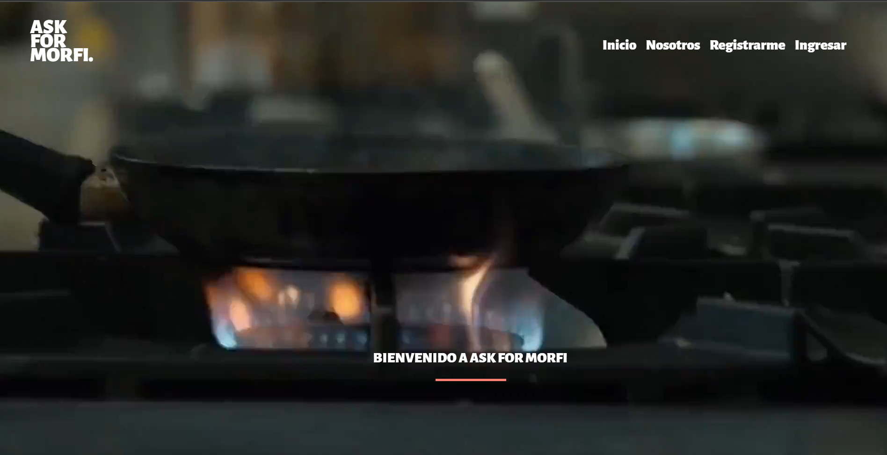
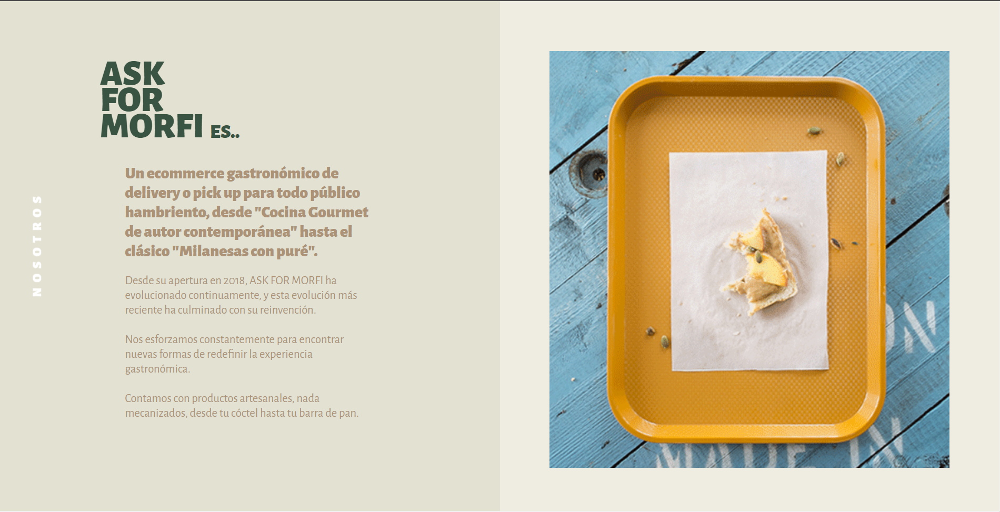
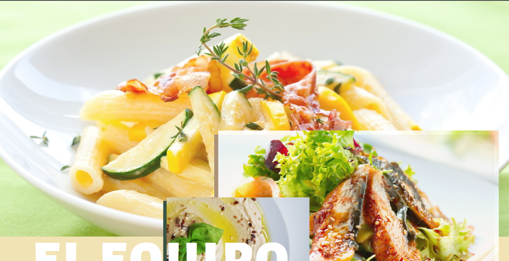
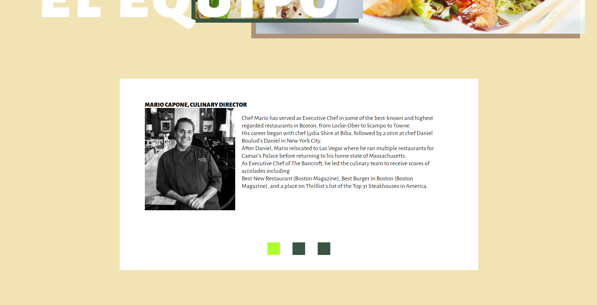
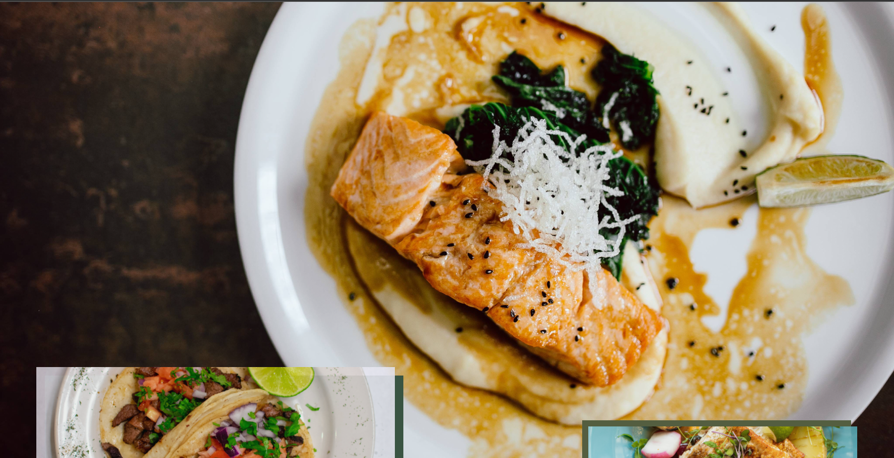
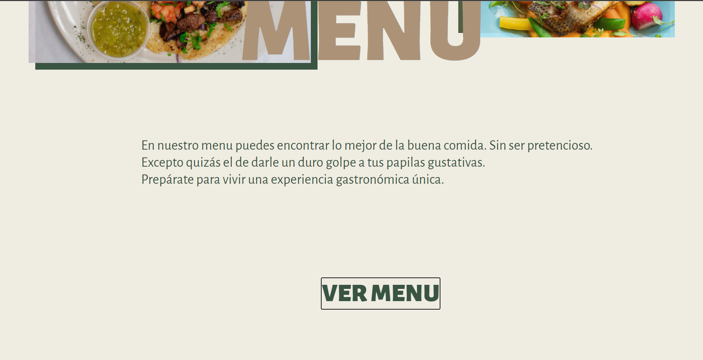
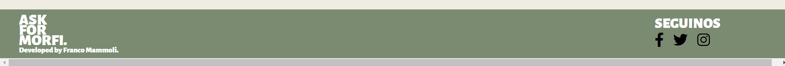
 
<h2 align="center">Vista del menu </h2>
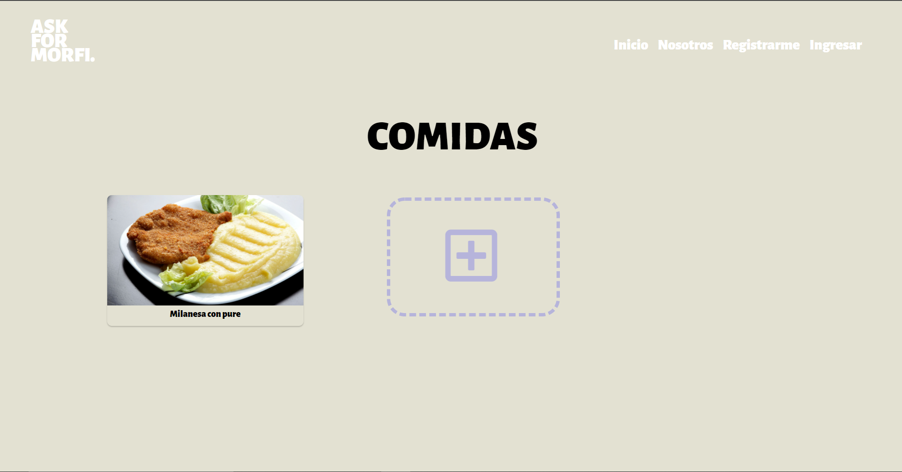
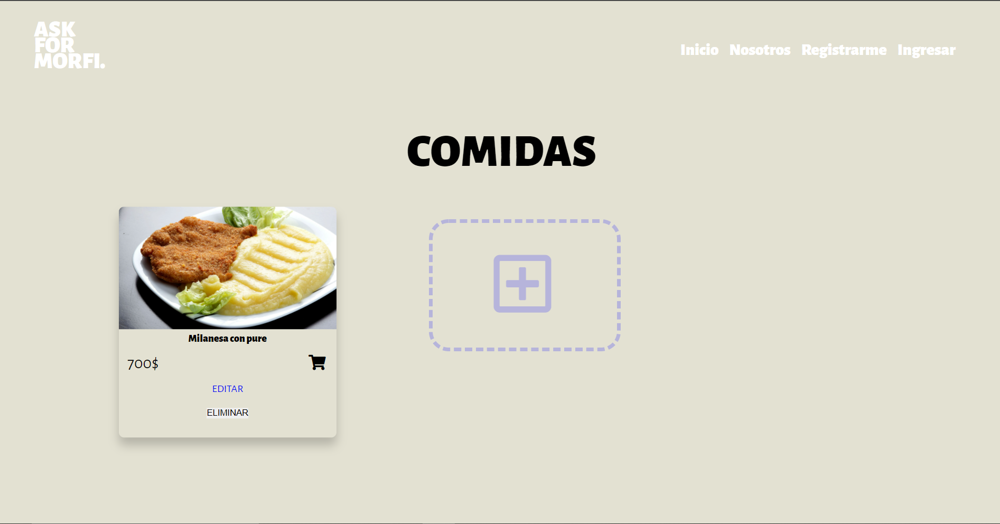
 
<h2 align="center">Formulario de registro</h2>
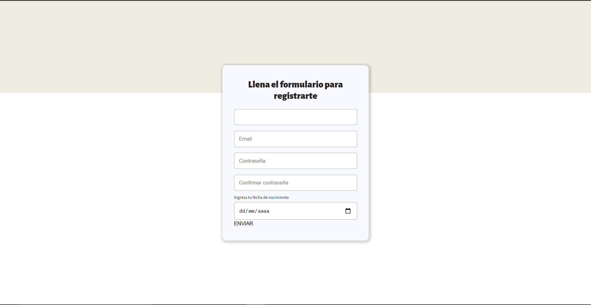
 
<h2 align="center">Formulario de login</h2>
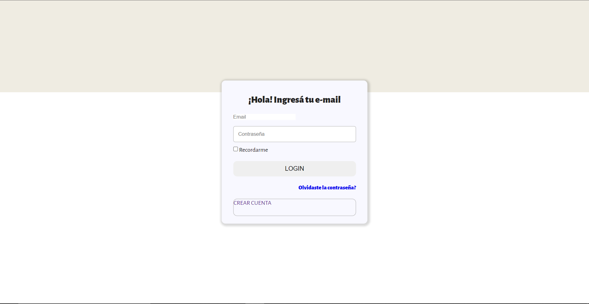
 
<h3> En la web podemos: </h3>
- Registrarnos/ logearnos
- Editar, Modificar, Eliminar producto del menu (CRUD)
<h3> Tecnologias usadas: </h3>
- Node.js
- Express
- Ejs
- MySQL
